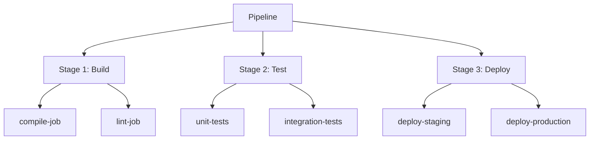
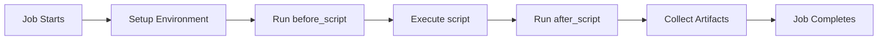

# GitLab CI/CD Fundamentals

## Understanding the Core Building Blocks

---

# Core Concepts Overview



<!--
style A fill:#e1f5fe
style B fill:#f3e5f5
style C fill:#e8f5e8
style D fill:#fff3e0
-->

<div class="grid grid-cols-3 gap-6 mt-6 mb-6">

<div v-click="1" class="text-center p-4 info-block">

### **Pipeline**

The complete workflow that runs automatically

</div>

<div v-click="2" class="text-center p-4 tip-block">

### **Stages**

Group jobs that run in parallel or sequence

</div>

<div v-click="3" class="text-center p-4 imp-block">

### **Jobs**

Individual tasks within stages

</div>
</div>

<!--
TODO: definition of pipeline

### Key Characteristics

- **Stages run sequentially**
- **Jobs within a stage run in parallel**
- **Pipeline fails if any job fails**
- **Each job runs in isolated environment**
-->

---

# Jobs - The Heart of CI/CD

<div class="grid grid-cols-2 gap-8">

<v-clicks fade>

- **Smallest unit of work** in a pipeline
- **Runs scripts** on GitLab Runners
- **Independent execution** environment
- **Configurable** with various options

</v-clicks>

<v-click>

```yaml {*|1|2|3-5|6-7|8-}
test-job:
  stage: test
  script:
    - npm install
    - npm run test
  rules:
    - if: $CI_PIPELINE_SOURCE == "push"
  artifacts:
    reports:
      junit: test-results.xml
```

</v-click>

</div>

<v-click>

### Execution Flow{.my-4}



<!--
style A fill:#e8f5e8
style G fill:#e8f5e8
style D fill:#f3e5f5
-->

</v-click>

<!--
[click:4] Think of jobs like functions in programming - they have a specific purpose and can be reused

- [click:2] Job name
- [click] Which stage
- [click] Commands to run
- [click] When to run
- [click] What to save

[click] Context between `before_script` and `after_script`
-->

---

# Stages - Organizing Your Workflow

<div class="grid grid-cols-2 gap-8">

<div>

## Default Stages

<v-click fade>

- `build`
- `test`
- `deploy`

</v-click>

<v-click>

## Custom Stages{.my-1}

You can define your own:

```yaml
stages:
  - prepare
  - compile
  - unit-test
  - integration-test
  - staging-deploy
  - production-deploy
  # etc.
```

</v-click>

</div>

<div v-click="3">

## Stage Behavior

<div class="space-y-4 mt-3">

<div class="p-3 detail-quote">

**Sequential Execution**: Stages run one after another

</div>

<div v-click="4" class="p-3 imp-quote">

**Parallel Jobs**: Jobs in same stage run simultaneously

</div>

<div v-click="5" class="p-3 tip-quote">

**Conditional**: Stages can be skipped based on conditions

</div>

<div v-click="6" class="p-3 danger-quote">

**Fail Fast**: If any stage fails, pipeline stops

</div>

</div>

</div>

</div>

<style>
.slidev-layout p {
  margin-top: 0;
  margin-bottom: 0;
}
</style>

<!--
[click] GitLab provides default stages

- [click:2] For example, `prepare` -> `compile` ...
- [click] Run simultaneously by default, or use `needs`
- [click] Use `workflow` or `rules`
- [click] Use `allow_failure`
-->

---

## Visual Pipeline Example

```mermaid {scale: 1}
gantt
    title Pipeline Execution Timeline
    dateFormat  X
    axisFormat %s

    section Build
    compile    :active, 0, 10
    lint       :active, 0, 8

    section Test
    unit-tests :11, 15
    e2e-tests  :11, 20

    section Deploy
    staging    :21, 25
    production :26, 30
```

<div class="flex h-full items-center">



</div>

---

# Pipelines - The Complete Picture

<div class="grid grid-cols-2 gap-8">

<div>

## Pipeline Triggers{.mb-4}

- **Push to branch**
- **Merge requests**

<v-click hide at="2">

- **Manual execution**
- **Scheduled runs**
- **API calls**
- **External webhooks**

</v-click>

</div>

<div>

## Pipeline Types{.mb-4}

- **Branch Pipeline**: Runs on every push
- **Merge Request Pipeline**: Runs on MR creation

<v-click hide at="2">

- **Scheduled Pipeline**: Runs on cron schedule
- **Tag Pipeline**: Runs on tag creation

</v-click>

</div>

</div>

<!--
[click] When to trigger a pipeline

[click] What type a pipeline is
-->
