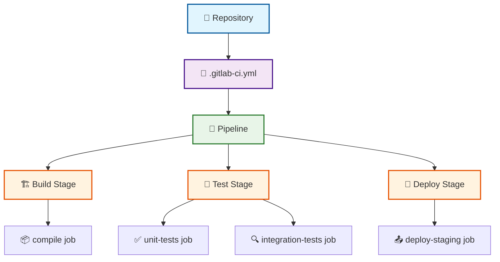

# GitLab CI/CD Introduction

## From Jenkins to GitLab CI

<div v-motion :initial="{ x: -80, opacity: 0 }" :enter="{ x: 0, opacity: 1 }" class="flex items-center justify-center gap-8 mt-16">
  <div class="text-8xl">🚀</div>
  <div class="text-right">
    <h3 class="text-3xl font-bold text-blue-600">Welcome to Modern CI/CD</h3>
    <p class="text-xl text-gray-600 mt-4">Simplifying DevOps with GitLab</p>
  </div>
</div>

---
layout: center
class: text-center
---

# Agenda

<div class="grid grid-cols-2 gap-8 mt-12">
  <div v-motion :initial="{ y: 50, opacity: 0 }" :enter="{ y: 0, opacity: 1, transition: { delay: 200 } }" class="p-6 bg-blue-50 rounded-lg">
    <div class="text-4xl mb-4">📚</div>
    <h3 class="font-bold text-lg">Fundamentals</h3>
    <p class="text-sm text-gray-600">Jobs, Pipelines, Runners</p>
  </div>
  
  <div v-motion :initial="{ y: 50, opacity: 0 }" :enter="{ y: 0, opacity: 1, transition: { delay: 400 } }" class="p-6 bg-green-50 rounded-lg">
    <div class="text-4xl mb-4">⚙️</div>
    <h3 class="font-bold text-lg">Configuration</h3>
    <p class="text-sm text-gray-600">Writing .gitlab-ci.yml</p>
  </div>
  
  <div v-motion :initial="{ y: 50, opacity: 0 }" :enter="{ y: 0, opacity: 1, transition: { delay: 600 } }" class="p-6 bg-purple-50 rounded-lg">
    <div class="text-4xl mb-4">⚡</div>
    <h3 class="font-bold text-lg">Advanced Features</h3>
    <p class="text-sm text-gray-600">Rules, Workflows, Variables</p>
  </div>
  
  <div v-motion :initial="{ y: 50, opacity: 0 }" :enter="{ y: 0, opacity: 1, transition: { delay: 800 } }" class="p-6 bg-orange-50 rounded-lg">
    <div class="text-4xl mb-4">🧩</div>
    <h3 class="font-bold text-lg">Components</h3>
    <p class="text-sm text-gray-600">Reusable CI/CD Building Blocks</p>
  </div>
</div>

---

# Why Migrate from Jenkins?

<div class="grid grid-cols-2 gap-12 mt-8">
  <div v-motion :initial="{ x: -50, opacity: 0 }" :enter="{ x: 0, opacity: 1 }">
    <h2 class="text-2xl font-bold text-red-600 mb-6">Jenkins Pain Points</h2>
    <ul class="space-y-3">
      <li class="flex items-center gap-3">
        <div class="w-2 h-2 bg-red-500 rounded-full"></div>
        <span>Complex setup and maintenance</span>
      </li>
      <li class="flex items-center gap-3">
        <div class="w-2 h-2 bg-red-500 rounded-full"></div>
        <span>Plugin dependency hell</span>
      </li>
      <li class="flex items-center gap-3">
        <div class="w-2 h-2 bg-red-500 rounded-full"></div>
        <span>Groovy scripting learning curve</span>
      </li>
      <li class="flex items-center gap-3">
        <div class="w-2 h-2 bg-red-500 rounded-full"></div>
        <span>Separate infrastructure management</span>
      </li>
      <li class="flex items-center gap-3">
        <div class="w-2 h-2 bg-red-500 rounded-full"></div>
        <span>Security patch overhead</span>
      </li>
    </ul>
  </div>

  <div v-motion :initial="{ x: 50, opacity: 0 }" :enter="{ x: 0, opacity: 1, transition: { delay: 300 } }">
    <h2 class="text-2xl font-bold text-green-600 mb-6">GitLab CI Advantages</h2>
    <ul class="space-y-3">
      <li class="flex items-center gap-3">
        <div class="w-2 h-2 bg-green-500 rounded-full"></div>
        <span>Built into GitLab platform</span>
      </li>
      <li class="flex items-center gap-3">
        <div class="w-2 h-2 bg-green-500 rounded-full"></div>
        <span>YAML-based configuration</span>
      </li>
      <li class="flex items-center gap-3">
        <div class="w-2 h-2 bg-green-500 rounded-full"></div>
        <span>Auto-scaling runners</span>
      </li>
      <li class="flex items-center gap-3">
        <div class="w-2 h-2 bg-green-500 rounded-full"></div>
        <span>Integrated DevOps workflow</span>
      </li>
      <li class="flex items-center gap-3">
        <div class="w-2 h-2 bg-green-500 rounded-full"></div>
        <span>Rich component ecosystem</span>
      </li>
    </ul>
  </div>
</div>

<div v-motion :initial="{ y: 50, opacity: 0 }" :enter="{ y: 0, opacity: 1, transition: { delay: 600 } }" class="mt-12 text-center p-6 bg-gradient-to-r from-blue-100 to-purple-100 rounded-lg">
  <h3 class="font-bold text-lg">Migration Strategy</h3>
  <p class="text-gray-700">Gradual transition with parallel execution during migration period</p>
</div>

---
layout: section
---

# Fundamental Concepts

<div v-motion :initial="{ scale: 0.8, opacity: 0 }" :enter="{ scale: 1, opacity: 1 }" class="text-center">
  <div class="text-6xl mb-8">🏗️</div>
  <p class="text-xl text-gray-600">Building blocks of GitLab CI/CD</p>
</div>

---

# The Big Picture

<div v-motion :initial="{ y: 30, opacity: 0 }" :enter="{ y: 0, opacity: 1 }">



</div>

---

# Jobs: The Atomic Units

<div v-motion :initial="{ x: -30, opacity: 0 }" :enter="{ x: 0, opacity: 1 }" class="mb-6">
  <h2 class="text-2xl font-bold">A <span class="text-blue-600">Job</span> = One unit of work</h2>
</div>

<div v-click="1">

```yaml
build-frontend:
  stage: build
  image: node:18-alpine
  script:
    - npm ci
    - npm run build
  artifacts:
    paths:
      - dist/
    expire_in: 1 hour
  cache:
    paths:
      - node_modules/
```

</div>

<div v-motion :initial="{ y: 30, opacity: 0 }" :enter="{ y: 0, opacity: 1, transition: { delay: 400 } }" class="mt-8 grid grid-cols-2 gap-8">
  <div class="bg-blue-50 p-4 rounded-lg">
    <h4 class="font-bold text-blue-800">Key Components</h4>
    <ul class="mt-2 space-y-1 text-sm">
      <li>🏷️ <strong>Name:</strong> Unique identifier</li>
      <li>🎭 <strong>Stage:</strong> Execution order</li>
      <li>🐳 <strong>Image:</strong> Runtime environment</li>
      <li>📝 <strong>Script:</strong> Commands to run</li>
    </ul>
  </div>
  
  <div class="bg-green-50 p-4 rounded-lg">
    <h4 class="font-bold text-green-800">Optional Features</h4>
    <ul class="mt-2 space-y-1 text-sm">
      <li>📦 <strong>Artifacts:</strong> Preserve outputs</li>
      <li>⚡ <strong>Cache:</strong> Speed up builds</li>
      <li>🔧 <strong>Variables:</strong> Job-specific config</li>
      <li>🌐 <strong>Services:</strong> Additional containers</li>
    </ul>
  </div>
</div>

---

# Pipelines: Orchestrating Jobs

<div v-motion :initial="{ scale: 0.9, opacity: 0 }" :enter="{ scale: 1, opacity: 1 }" class="mb-6">
  <h2 class="text-2xl font-bold">A <span class="text-green-600">Pipeline</span> = Collection of jobs in stages</h2>
</div>

<div class="grid grid-cols-2 gap-8">
  <div v-click="1">

```yaml
stages:
  - build
  - test
  - deploy

build-job:
  stage: build
  script: echo "Building..."

test-unit:
  stage: test
  script: echo "Unit testing..."

test-integration:
  stage: test
  script: echo "Integration testing..."

deploy-staging:
  stage: deploy
  script: echo "Deploying to staging..."
  needs: [test-unit]
```

  </div>

  <div v-motion :initial="{ x: 30, opacity: 0 }" :enter="{ x: 0, opacity: 1, transition: { delay: 500 } }">
    <div class="bg-purple-50 p-6 rounded-lg">
      <h4 class="font-bold text-purple-800 mb-4">Pipeline Behavior</h4>
      <ul class="space-y-3 text-sm">
        <li class="flex items-start gap-2">
          <span class="text-purple-600">🔄</span>
          <span><strong>Sequential stages</strong> run in order</span>
        </li>
        <li class="flex items-start gap-2">
          <span class="text-purple-600">⚡</span>
          <span><strong>Parallel jobs</strong> within same stage</span>
        </li>
        <li class="flex items-start gap-2">
          <span class="text-purple-600">🎯</span>
          <span><strong>Dependencies</strong> with <code>needs</code></span>
        </li>
        <li class="flex items-start gap-2">
          <span class="text-purple-600">🔀</span>
          <span><strong>Conditional logic</strong> with rules</span>
        </li>
      </ul>
    </div>

    <div v-click="2" class="mt-6 p-4 bg-yellow-50 rounded-lg">
      <p class="text-sm"><strong>💡 Jenkins Analogy:</strong></p>
      <p class="text-sm text-gray-600">Pipeline = Jenkins Pipeline<br/>Job = Jenkins Build Step</p>
    </div>

  </div>
</div>

---

# Runners: The Execution Engine

<div v-motion :initial="{ y: -20, opacity: 0 }" :enter="{ y: 0, opacity: 1 }" class="mb-8">
  <h2 class="text-2xl font-bold"><span class="text-orange-600">Runners</span> execute your jobs</h2>
</div>

<div class="grid grid-cols-3 gap-6">
  <div v-motion :initial="{ y: 50, opacity: 0 }" :enter="{ y: 0, opacity: 1, transition: { delay: 200 } }" class="bg-blue-50 p-6 rounded-lg text-center">
    <div class="text-4xl mb-4">🌐</div>
    <h3 class="font-bold text-blue-800 mb-2">Shared Runners</h3>
    <ul class="text-sm space-y-1">
      <li>✅ GitLab.com provided</li>
      <li>✅ Auto-scaling</li>
      <li>✅ Free tier available</li>
      <li>✅ Docker-based</li>
    </ul>
  </div>

  <div v-motion :initial="{ y: 50, opacity: 0 }" :enter="{ y: 0, opacity: 1, transition: { delay: 400 } }" class="bg-green-50 p-6 rounded-lg text-center">
    <div class="text-4xl mb-4">👥</div>
    <h3 class="font-bold text-green-800 mb-2">Group Runners</h3>
    <ul class="text-sm space-y-1">
      <li>🏢 Organization-wide</li>
      <li>⚙️ Custom configuration</li>
      <li>🔒 Internal network access</li>
      <li>📊 Shared resources</li>
    </ul>
  </div>

  <div v-motion :initial="{ y: 50, opacity: 0 }" :enter="{ y: 0, opacity: 1, transition: { delay: 600 } }" class="bg-purple-50 p-6 rounded-lg text-center">
    <div class="text-4xl mb-4">🎯</div>
    <h3 class="font-bold text-purple-800 mb-2">Project Runners</h3>
    <ul class="text-sm space-y-1">
      <li>🛠️ Project-specific</li>
      <li>🔧 Custom environments</li>
      <li>📊 Dedicated resources</li>
      <li>🔐 Maximum security</li>
    </ul>
  </div>
</div>

<div v-motion :initial="{ scale: 0.9, opacity: 0 }" :enter="{ scale: 1, opacity: 1, transition: { delay: 800 } }" class="mt-8 p-4 bg-gray-50 rounded-lg">

```yaml
# Target specific runners with tags
performance-test:
  tags:
    - docker
    - high-memory
  script:
    - run-performance-tests.sh
```

</div>


---
src: ./01-configuration.md
---

---
src: ./02-advanced.md  
---

---
src: ./04-components.md
---

---
src: ./05-demos.md
---

---
layout: end
class: text-center
---

# Questions & Migration Planning

<div v-motion :initial="{ y: 30, opacity: 0 }" :enter="{ y: 0, opacity: 1 }" class="mt-12">
  <div class="text-6xl mb-8">🤔</div>
  <p class="text-xl text-gray-600">Ready to start your GitLab CI journey?</p>
</div>

<div v-motion :initial="{ y: 30, opacity: 0 }" :enter="{ y: 0, opacity: 1, transition: { delay: 300 } }" class="mt-8 grid grid-cols-2 gap-8">
  <div class="bg-blue-50 p-6 rounded-lg">
    <h3 class="font-bold text-blue-800">Next Steps</h3>
    <ul class="mt-4 space-y-2 text-sm">
      <li>🔄 Identify pilot projects</li>
      <li>📝 Create migration timeline</li>
      <li>🧪 Set up sandbox environment</li>
      <li>📚 Team training sessions</li>
    </ul>
  </div>
  
  <div class="bg-green-50 p-6 rounded-lg">
    <h3 class="font-bold text-green-800">Resources</h3>
    <ul class="mt-4 space-y-2 text-sm">
      <li>📖 GitLab CI/CD documentation</li>
      <li>🧩 Component catalog</li>
      <li>💬 Community forums</li>
      <li>🎯 Migration guides</li>
    </ul>
  </div>
</div>
