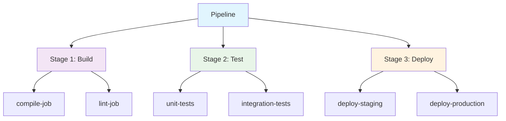
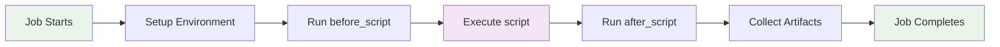

# GitLab CI/CD Fundamentals
## Understanding the Core Building Blocks

<div v-motion :initial="{ x: -80 }" :enter="{ x: 0 }" :delay="300" class="mt-8">
  <span class="text-lg opacity-75">Let's start with the basics...</span>
</div>

---
layout: two-cols-header
---

# Core Concepts Overview

<div class="grid grid-cols-3 gap-6 mt-6">

<div v-click="1" class="text-center p-4 info-block">

## 📋 **Pipeline**
The complete workflow that runs automatically

</div>

<div v-click="2" class="text-center p-4 tip-block">

## 🎭 **Stages**
Sequential phases of your pipeline

</div>

<div v-click="3" class="text-center p-4 imp-block">

## ⚡ **Jobs**
Individual tasks within stages

</div>

</div>

::left::

<v-click="4">

### Pipeline Hierarchy



</v-click>

::right::

<v-clicks>

### Key Characteristics

- **Stages run sequentially** ⬇️
- **Jobs within a stage run in parallel** ↔️
- **Pipeline fails if any job fails** ❌
- **Each job runs in isolated environment** 🏠

</v-clicks>

---


# Jobs - The Heart of CI/CD

<div class="grid grid-cols-2 gap-8">

<div>

## What is a Job? 🔧

<v-clicks>

- **Smallest unit of work** in a pipeline
- **Runs scripts** on GitLab Runners  
- **Independent execution** environment
- **Configurable** with various options

</v-clicks>

<div v-click="5" class="mt-4 p-4 bg-yellow-50 dark:bg-yellow-900/20 rounded-lg border-l-4 border-yellow-400">

💡 **Think of jobs like functions in programming - they have a specific purpose and can be reused!**

</div>

</div>

<div>

## Basic Job Structure

```yaml {all|1|2|3-5|6-8|9-10}
test-job:                    # Job name
  stage: test               # Which stage
  script:                   # Commands to run
    - npm install
    - npm run test
  rules:                    # When to run
    - if: $CI_PIPELINE_SOURCE == "push"
  artifacts:                # What to save
    reports:
      junit: test-results.xml
```

<v-click="6">

### Job Execution Flow


</v-click>

</div>

</div>

---


# Stages - Organizing Your Workflow

<div class="grid grid-cols-2 gap-8">

<div>

## Default Stages 📊

<v-click="1">

GitLab provides default stages:

```yaml
stages:
  - build
  - test  
  - deploy
```

</v-click>

<v-click="2">

## Custom Stages 🎨

You can define your own:

```yaml
stages:
  - prepare
  - compile
  - unit-test
  - integration-test
  - security-scan
  - package
  - staging-deploy
  - production-deploy
```

</v-click>

</div>

<div>

<v-click="3">

## Stage Behavior 🚦

<div class="space-y-4">

<div class="p-3 bg-green-50 dark:bg-green-900/20 rounded border-l-4 border-green-400">

✅ **Sequential Execution**: Stages run one after another

</div>

<div class="p-3 bg-blue-50 dark:bg-blue-900/20 rounded border-l-4 border-blue-400">

🔄 **Parallel Jobs**: Jobs in same stage run simultaneously  

</div>

<div class="p-3 bg-red-50 dark:bg-red-900/20 rounded border-l-4 border-red-400">

❌ **Fail Fast**: If any stage fails, pipeline stops

</div>

<div class="p-3 bg-purple-50 dark:bg-purple-900/20 rounded border-l-4 border-purple-400">

⏭️ **Conditional**: Stages can be skipped based on conditions

</div>

</div>

</v-click>

<v-click="4">

## Visual Pipeline Example

```mermaid {scale: 0.6}
gantt
    title Pipeline Execution Timeline
    dateFormat  X
    axisFormat %s
    
    section Build
    compile    :active, 0, 10s
    lint       :active, 0, 8s
    
    section Test  
    unit-tests :11s, 15s
    e2e-tests  :11s, 20s
    
    section Deploy
    staging    :21s, 25s
    production :26s, 30s
```

</v-click>

</div>

</div>

---


# Pipelines - The Complete Picture

<div class="grid grid-cols-2 gap-8">

<div>

## Pipeline Triggers 🚀

<v-clicks>

- **Push to branch** 📤
- **Merge requests** 🔀
- **Scheduled runs** ⏰
- **Manual execution** 👆
- **API calls** 🔗
- **External webhooks** 📡

</v-clicks>

<v-click="7">

## Pipeline Types 📋

<div class="space-y-2 mt-4">

<div class="p-2 bg-blue-50 dark:bg-blue-900/20 rounded">

**Branch Pipeline**: Runs on every push

</div>

<div class="p-2 bg-green-50 dark:bg-green-900/20 rounded">

**Merge Request Pipeline**: Runs on MR creation

</div>

<div class="p-2 bg-purple-50 dark:bg-purple-900/20 rounded">

**Tag Pipeline**: Runs on tag creation

</div>

<div class="p-2 bg-orange-50 dark:bg-orange-900/20 rounded">

**Scheduled Pipeline**: Runs on cron schedule

</div>

</div>

</v-click>

</div>

<div>

<v-click="8">

## Pipeline States 🚦

<div class="space-y-3">

<div class="flex items-center space-x-3">
  <div class="w-4 h-4 bg-blue-500 rounded-full"></div>
  <span>**Running**: Currently executing</span>
</div>

<div class="flex items-center space-x-3">
  <div class="w-4 h-4 bg-green-500 rounded-full"></div>
  <span>**Passed**: All jobs successful</span>
</div>

<div class="flex items-center space-x-3">
  <div class="w-4 h-4 bg-red-500 rounded-full"></div>
  <span>**Failed**: At least one job failed</span>
</div>

<div class="flex items-center space-x-3">
  <div class="w-4 h-4 bg-yellow-500 rounded-full"></div>
  <span>**Warning**: Passed with warnings</span>
</div>

<div class="flex items-center space-x-3">
  <div class="w-4 h-4 bg-gray-500 rounded-full"></div>
  <span>**Canceled**: Manually stopped</span>
</div>

<div class="flex items-center space-x-3">
  <div class="w-4 h-4 bg-orange-500 rounded-full"></div>
  <span>**Skipped**: Conditions not met</span>
</div>

</div>

</v-click>

<v-click="9">

## GitLab Runners 🏃‍♂️

<div class="mt-6 p-4 bg-gray-50 dark:bg-gray-800 rounded-lg">

**Runners execute your jobs!**

- **Shared Runners**: Provided by GitLab
- **Group Runners**: Shared across group projects  
- **Specific Runners**: Dedicated to your project

</div>

</v-click>

</div>

</div>

---
layout: center
class: text-center
---

# Quick Recap 📝

<div v-motion :initial="{ scale: 0.8, opacity: 0 }" :enter="{ scale: 1, opacity: 1 }" :delay="200" class="grid grid-cols-3 gap-8 mt-8">

<div class="p-6 border rounded-xl bg-gradient-to-br from-blue-50 to-blue-100 dark:from-blue-900/20 dark:to-blue-800/20">

## Pipeline 🔄
Complete automated workflow triggered by events

</div>

<div class="p-6 border rounded-xl bg-gradient-to-br from-green-50 to-green-100 dark:from-green-900/20 dark:to-green-800/20">

## Stages 📊  
Sequential phases that organize your workflow

</div>

<div class="p-6 border rounded-xl bg-gradient-to-br from-purple-50 to-purple-100 dark:from-purple-900/20 dark:to-purple-800/20">

## Jobs ⚡
Individual tasks that do the actual work

</div>

</div>

<div v-click class="mt-8 text-2xl">
  <span class="text-gradient bg-gradient-to-r from-teal-400 to-blue-500 font-bold">
    Now let's see how to configure them! 🛠️
  </span>
</div>